# UI Prototype

This document will give an UI Prototype before coding and implementing the project. 

The Mini.chat website has seven main pages: 

* **Home**
* **Templates**
* **Template Detail**
* **Prices**
* **Career**
* **Login**
* **Profile**	

## Home Page
This page introduces how the services can be provided for both ordinary and advanced customers.

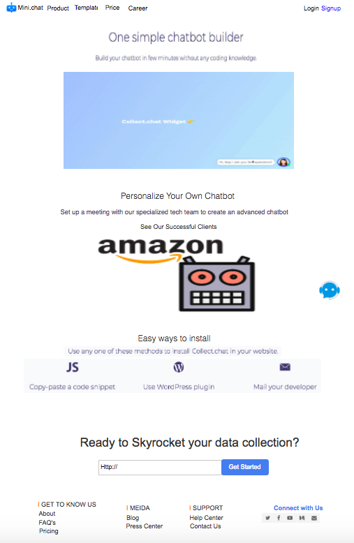

The whole website is a single-page website application; therefore, it keeps the same fixed header and footer. When the user logs in or signs up the page, the up right part of navigation will be changed to user's image and username.

After the user files out the user's company website address and clicks the Get Started button, the small signup window will pop up and business website will show the address automatically.

## Signup Popup

The signup page actually is a popup window. The user will file out username, the website url, business email and password to get started

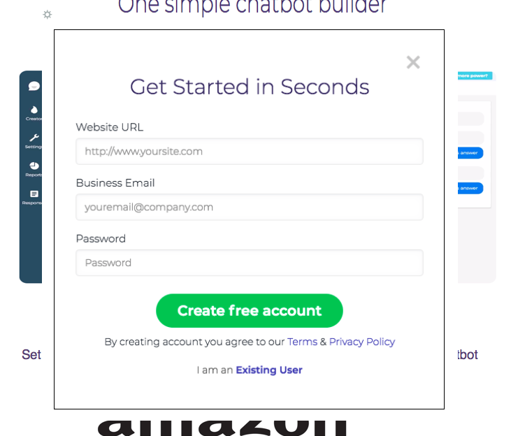

## Login Page

This page will check if email and password users file out are matched or not. After users clicking Sign in button, the webpage will direct to the original page before users directed to Login page.

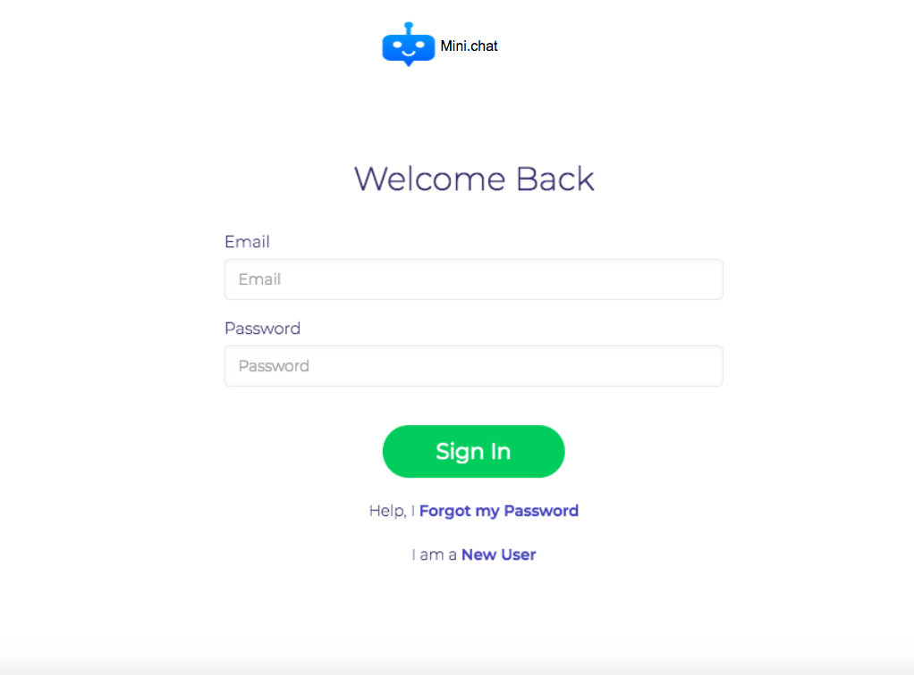

## Templates Page

This page will use grids to show different templates under each industry category. When users clicking the category in the left-side nav bar, the templates will be changed accordingly. 

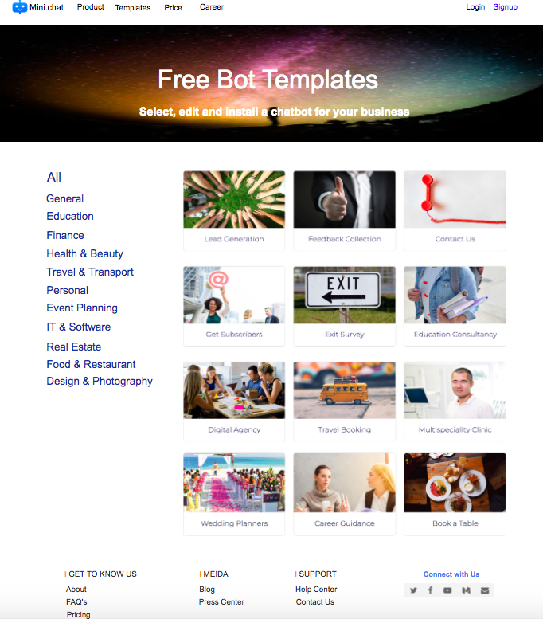

## Template Detail Page

This template detail page is shown after the user clicks one of the template in the Templates page. The right-side will show a trial demo and description. 

For the green, there are two circumstances. If users have already logged in, the button will show "Get Now" and when users click the button and profile will get this request and green button will change to "Used". Otherwise, the button will show "Try" and when users click the button, the login page will show and users can log in or sign up. After that, users will be directed to the template detail page and button will be changed to "Get Now". Following steps will be the same.

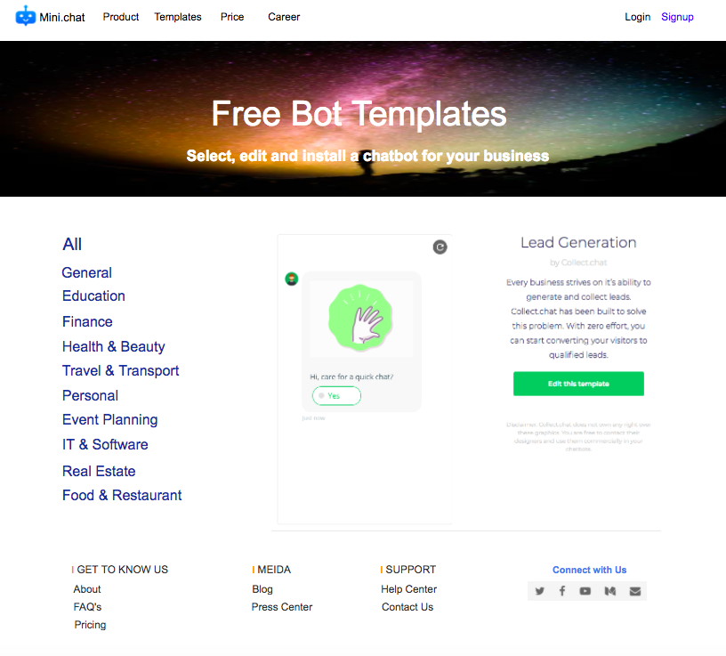

## Price Page

This price page will show different levels of our services and contents. Users can select pay monthly or yearly. Prices will be changed accordingly but contents under each level will keep the same.

When the user clicks Signup button, the Signup popup window will be initiated and after signup or login, the page will be returned to Price page.

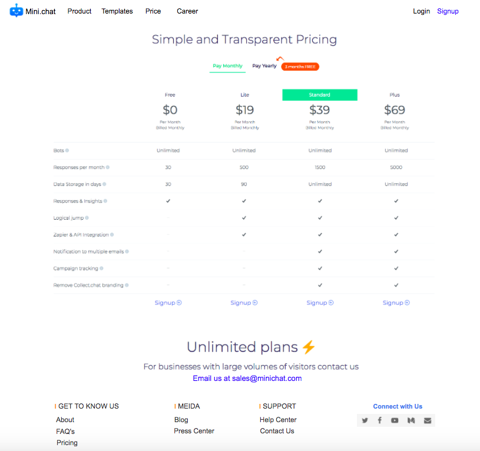

## Profile

Profile page contains two parts:

* **Basic Info** (username, first name, last name, phone number, business email, website url)
* **Plan & Templates** (Plan type and the templates which users selected from Templates page)

**Basic Info**

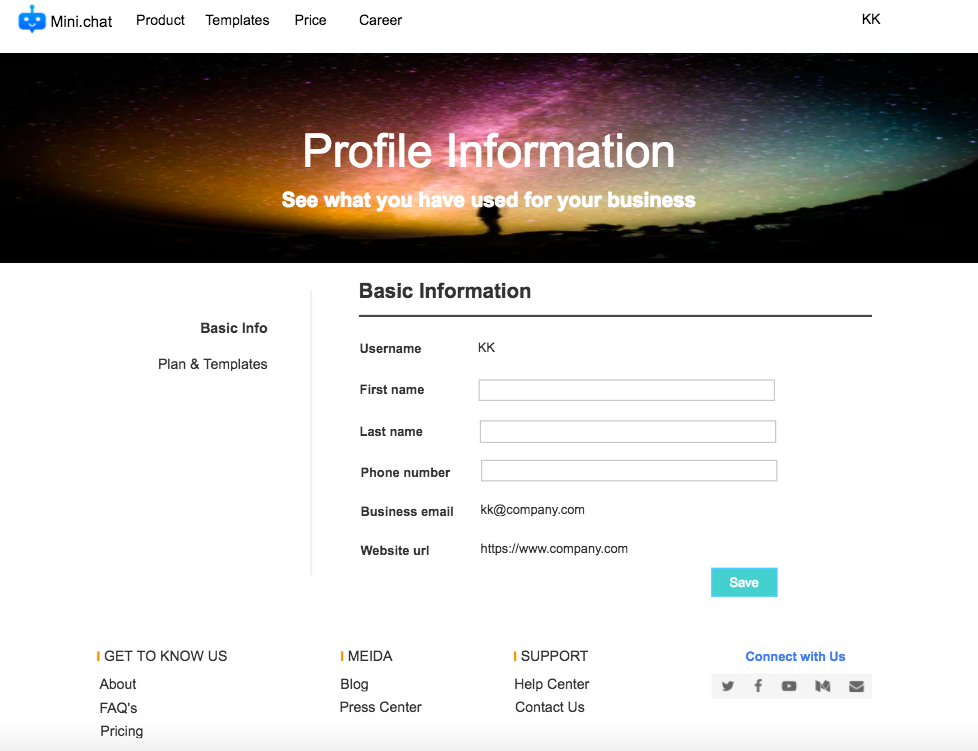

This page shows the user's basic information. Since on the Signup page, the database has saved the user's username, businss email, and website url, this page will shows those info as default. When user file out first name, last name, and phone number and then click Save button, this page will refresh and show the complete info. Save button will be changed to Edit.

**Plan & Templates**

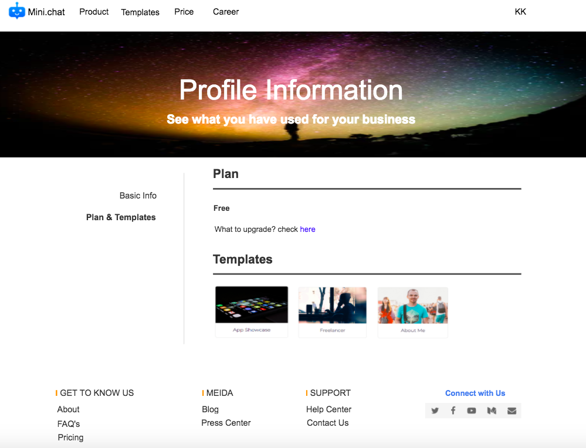

When the user clicks Plan & Templates on the left side nav, plan and templates the user selected are shown. Free plan is as default. If the user does not choose any template, "No template selected yet" is shown as default.

## Career

This page will show the jobs we are currently recruiting. Users can use left-side navigation to choose the jobs they are willing to apply for. The page also shows email address to receive the applications. Currently, there are three jobs:

* **Full stack developer** 
* **Senior Software Engineer** 
* **Digital Marketing Specialist** 

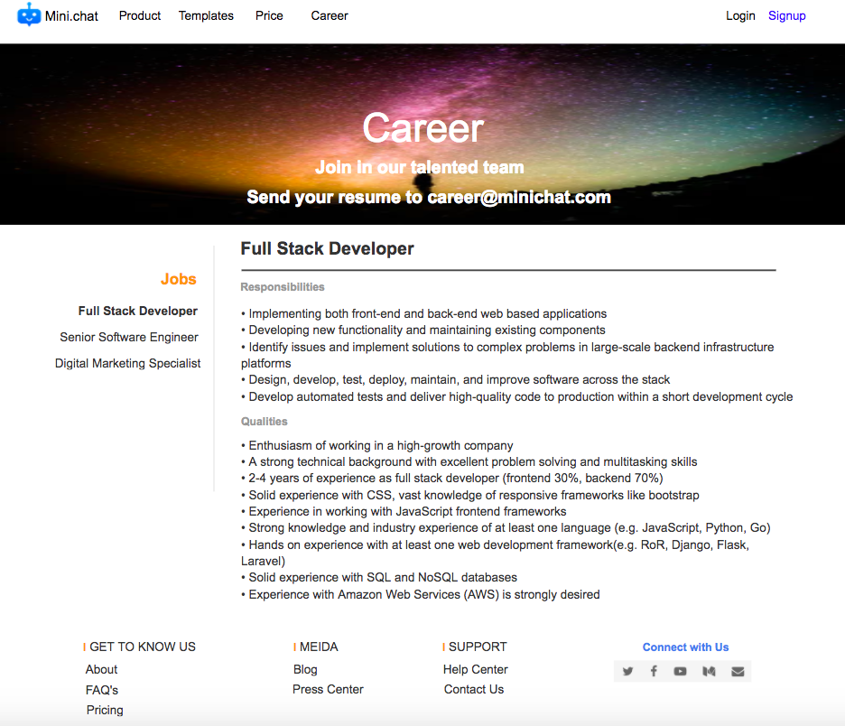

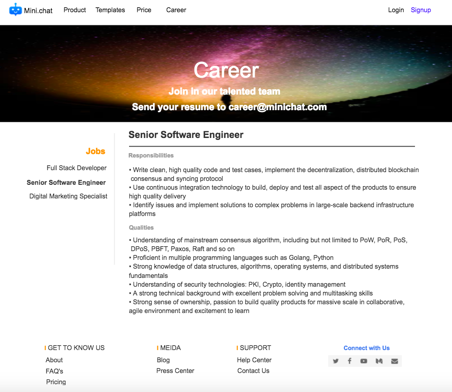

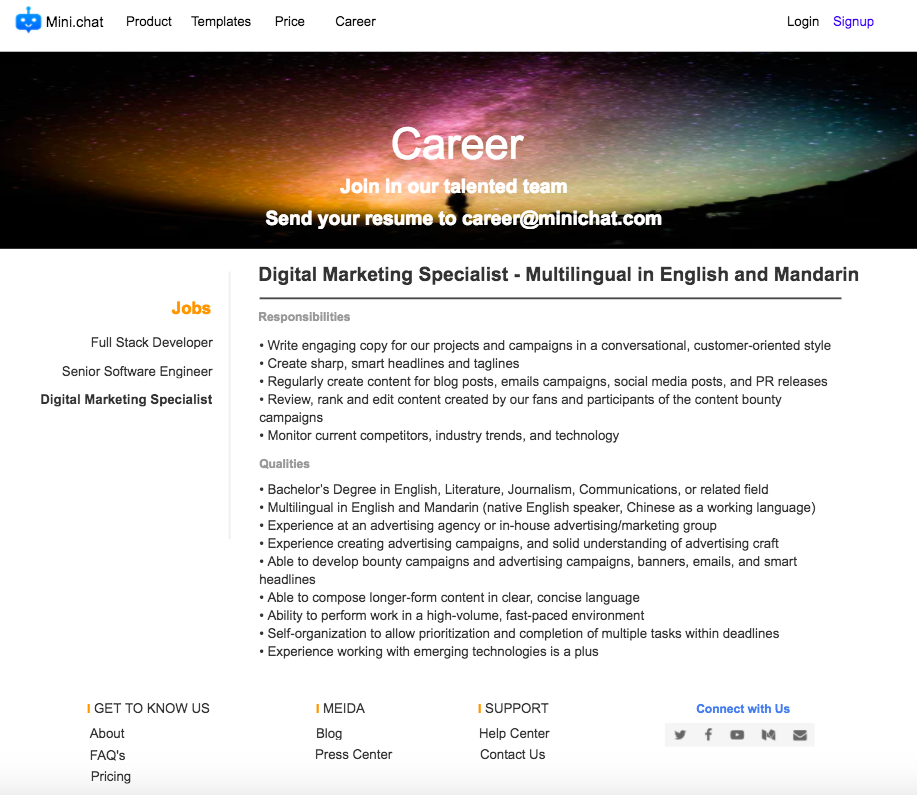